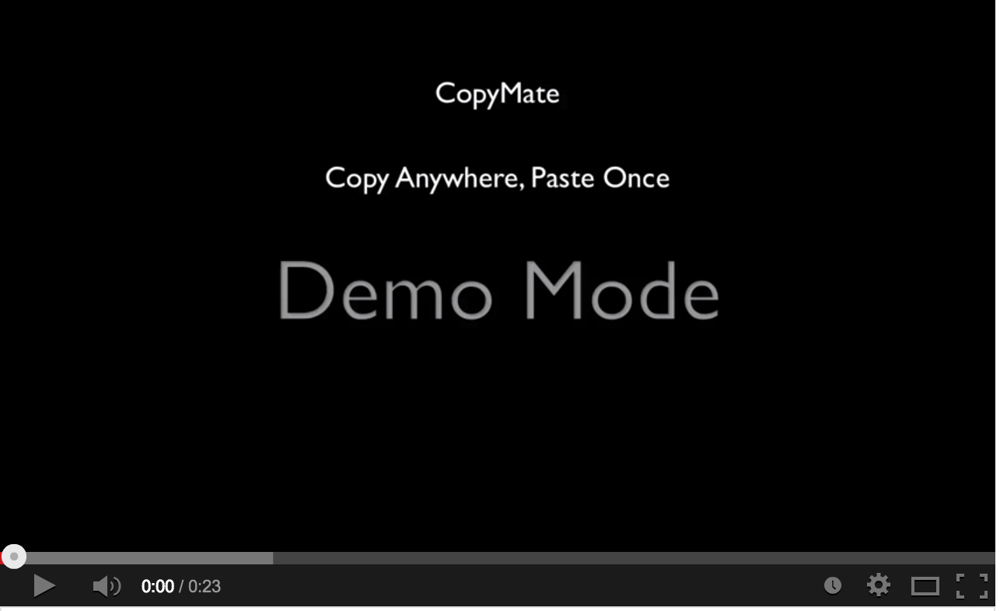

##CopyMate

####Copy Anywhere, Paste once.

Flow:

	⌘+C -> ⌃⇧C -> ⌃⇧C -> ⌃⇧2 -> ⌃⇧C -> ⌘V  
	
	Copy -> Append Copy -> Append Copy -> Change separator to space -> Append Copy -> Paste
	
Demo:

####Credits

1. [quickcursor](https://github.com/jessegrosjean/quickcursor)
2. [MASShortcut](https://github.com/shpakovski/MASShortcut)
2. <a href="http://thenounproject.com/noun/copy-text/#icon-No14015" target="_blank">Copy Text</a> designed by <a href="http://thenounproject.com/Cobretti" target="_blank">Chris Alpaerts</a> from The Noun Project

####License

MIT